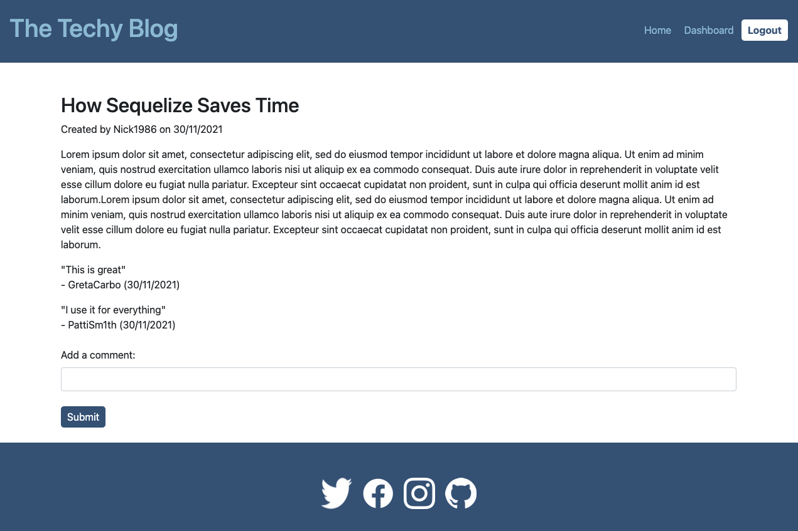

# The Techy Blog
>A CMS-style blog site where developers can publish their blog posts and comment on other developers’ posts.
> Live demo [_here_](https://ancient-headland-48213.herokuapp.com/).

## Table of Contents

- [General Info](#general-information)
- [Technologies Used](#technologies-used)
- [Features](#features)
- [Screenshots](#screenshots)
- [Setup](#setup)
- [Usage](#usage)
- [Project Status](#project-status)
- [Room for Improvement](#room-for-improvement)
- [Contact](#contact)
- [License](#license)

## General Information

The Techy Blog is a simple blog style website where developers can publish articles and share their thoughts with other developers. Users van also comment on other user's articles. 

## Technologies Used

- JavaScript
- CSS3
- Bootstrap v5.1
- Node.js
- Express.js
- Express Handlebars
- Express Sessions
- Connect Sessions Sequelize 
- MySQL2
- Sequelize
- Bcrypt
- Dotenv

## Features

- Create, update and delete blog posts
- Create, update and delete comments
- Blog editor for logged in users

## Screenshots




## Setup

This project requires Node.js and MySQL to be installed.

Once project has been cloned, run the following in the command line to install the project dependencies - Sequelize, MySQL2, Express.js, Express Handlbars, Express Sessions, Connect Sessions Sequelize, Bcrypt and Dotenv:

```
npm install
```

When dependencies have been installed, set up your environment variables in the .env.EXAMPLE file with your MySQL user and password. Remember to remove ".EXAMPLE" from the file name before continuing.

Next create your database by entering the following commands:

```
mysql -u root -p
```

Enter your MySQL password when prompted. Set up your database with the following command:

```
SOURCE db/schema.sql;
```

Check that your techblog_db database has been created by using the following command:

```
SHOW DATABASES;
```

Once the database has been created, exit the MySQL command line.

## Usage

Set up test seeds for the database by executing:

```
npm run seed

or

node seeds/seed.js
```

Enter the following to run the application and start the local server:

```
npm start

or

node server.js
```

## Project Status

Project is: _in progress_ 

## Room for Improvement

- Design could be improved with containers and styling to separate sections on website. For example, how comments are displayed under article.
- Design could be improved for forms.

To do:

- Add a Handlbars Helper to replace line breaks so that paragraphs can be rendered. Currently, new blog posts are stored with no paragraph breaks and are rendered in one paragraph.
- Add option to upload images in blog. 
- Add more content

## Contact

Created by [@lilyso](https://github.com/lilyso) - feel free to contact me!


## License
This project is open source and available under the [MIT License](LICENSE).

